# Git 사용자 가이드

본 가이드에서 참고하고 있는 Git 클라이언트는 Eclipse Oxygen(4.7.3) 에 기본적으로 내장되어 있는 EGit 플러그인을 기준으로 하였습니다.

## 1. Git 기본 개념

Git이란 소스코드를 효과적으로 관리하기 위해 개발된 '분산형 버전 관리 시스템'입니다. 원래는 Linux 소스코드를 관리할 목적으로 개발 되었습니다.

### 1.1 이력을 관리하는 저장소

저장소(Git repository)란 말그대로 파일이나 폴더를 저장해 두는 곳입니다. 그런데 Git 저장소가 제공하는 좋은 점 중 하나는 파일이 변경 이력 별로 구분되어 저장된다는 점입니다. 비슷한 파일이라도 실제 내용 일부 문구가 서로 다르면 다른 파일로 인식하기 때문에 파일을 변경 사항 별로 구분해 저장할 수 있습니다.

#### a. 원격 저장소와 로컬 저장소
Git은 원격 저장소와 로컬 저장소 두 종류의 저장소를 제공합니다.

- 원격 저장소(Remote Repository): 파일이 원격 저장소 전용 서버에서 관리되며 여러 사람이 함께 공유하기 위한 저장소입니다.
- 로컬 저장소(Local Repository): 내 PC에 파일이 저장되는 개인 전용 저장소입니다.

평소에는 내 PC의 로컬 저장소에서 작업하다가 작업한 내용을 공개하고 싶을 때에 원격 저장소에 업로드 합니다. 물론 원격 저장소에서 다른 사람이 작업한 파일을 로컬 저장소로 가져올 수도 있습니다.

#### b. 저장소 만들기

내 컴퓨터에 로컬 저장소를 만드는 방법은 두 가지가 있습니다.

첫 번째, 아예 저장소를 새로 만들거나, 두번째, 이미 만들어져 있는 원격 저장소를 로컬 저장소로 복사(Clone)해 올 수 있습니다.

### 1.2 변경을 기록하는 Commit

파일 및 폴더의 추가/변경 사항을 저장소에 기록하려면 'commit'이란 버튼을 눌러줘야 합니다.

커밋 버튼을 누르면 이전 커밋 상태부터 현재 상태까지의 변경 이력이 기록된 커밋(혹은 리비전)이 만들어집니다.

커밋은 아래 그림처럼 시간순으로 저장됩니다. 최근 커밋부터 거슬러 올라가면 과거 변경 이력과 내용을 알 수 있습니다.

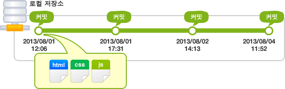

커밋은 이렇게 이력을 남기는 중요한 작업이기 때문에 커밋 버튼을 누를땐 커밋 메시지를 필수로 입력해야 합니다. 메시지가 없으면 커밋이 실행되지 않습니다.

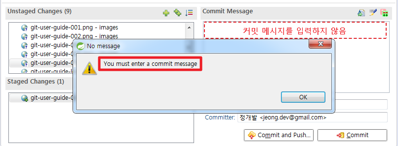

### 1.3 작업 트리(Work tree)와 인덱스(Index)

Git 에서는 우리가 흔히 말하는 폴더를 '작업 트리'(Work Tree)라고 부릅니다.

그리고 커밋을 실행하기 전의 저장소와 작업 트리 사이에 존재하는 공간을 '인덱스'라고 합니다.

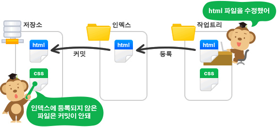

Git의 'Commit' 작업은 '작업 트리'에 있는 변경 내용을 저장소에 바로 기록하는 것이 아니라 그 사이 공간인 '인덱스'에 파일 상태를 기록(stage - 스테이징 한다고 표현하기도 합니다)하게 되어 있습니다. 따라서 저장소에 변경 사항을 기록하기 위해서는, 기록하고자 하는 모든 변경 사항들이 '인덱스'에 존재해야 합니다.

예를 들어, 11개의 파일을 수정했지만 그 중에 3개만 저장소에 반영하고 싶을 때 변경한 11개의 파일 중 3개를 선택하는 작업이 바로 '인덱스에 등록' 또는 '스테이징(stage)'이라 표현하는 작업 입니다.

이클립스에서는 `Git Staging` 화면에서 Commit하고자 하는 파일을 선택 후 상위 `+` 아이콘을 누르거나 마우스 오른쪽 버튼을 클릭 후 `Add to Index` 메뉴를 클릭하여 Staged Changes 에 등록할 수 있습니다.

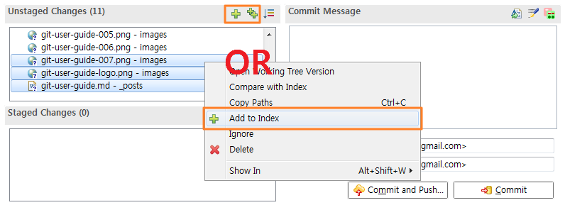

이렇게 인덱스란 공간이 중간에 있는 덕분에 작업 트리 안에 있는 커밋이 필요 없는 파일들을 커밋에 포함하지 않을 수 있고, 파일에서 내가 원하는 일부 변경 사항만 인덱스에 등록해 커밋할 수 있습니다.

## 2. Git 기본 사용법

### 2.1 초기설정

#### a. Commit 사용자명 등록

설치한 Git에 본인의 사용자명과 메일 주소를 등록해주세요. 여기서 설정한 사용자 정보는 차후에 Git Repository 변경 이력 등에 표시됩니다.

  1. Window > Preferences > Team > Git > Configuration > User Setting 으로 이동

  2. `Add Entry` 클릭 

  3. user.name 과 user.email 입력 후 `OK` 클릭 (2개의 Entry를 등록)

  4. `Apply and Close` 클릭
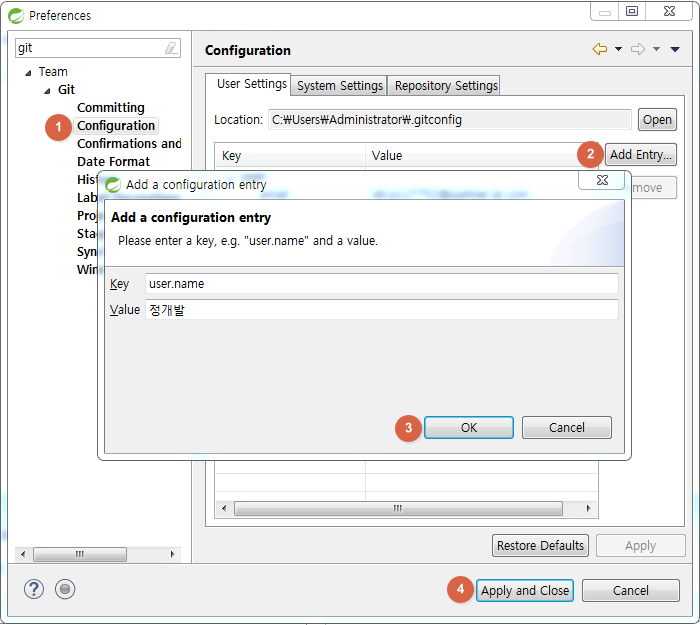

  5. 이클립스를 재시작한 후 아래와 같이 Git Staging 화면에서 Author, Committer가 설정 되었는지 확인
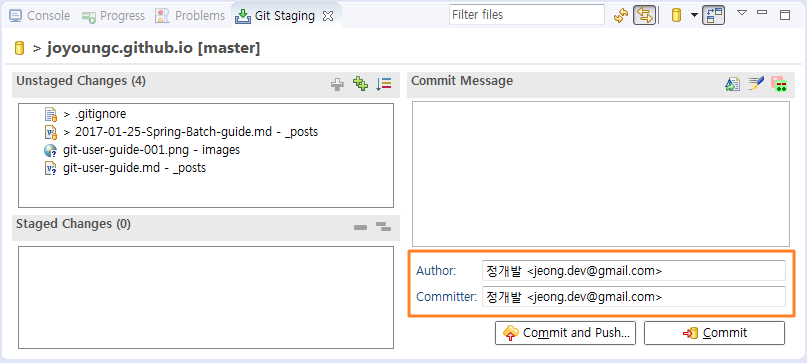

### 2.2 Repository 초기설정

#### a. 신규생성

#### b. 복제하기

### 2.3 파일 Commit 하기

원격 저장소에서 Clone 해온 프로젝트에 파일을 등록합니다. 그중 새로 등록한 이미지 3개를 인덱스에 등록(Staging)해줍니다. 

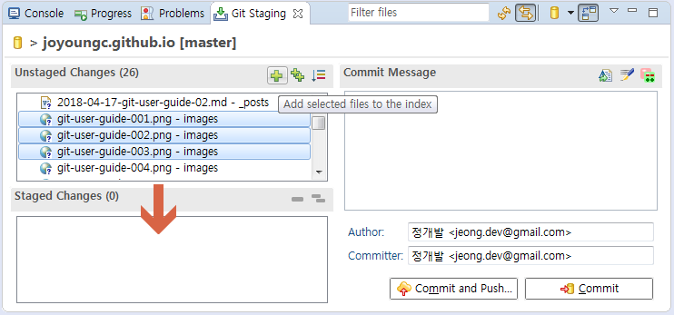

아래와 같이 Staging된 3개의 이미지 파일을 선택 후 Commit Message란에 커밋 메시지를 입력한 후 `Commit` 버튼을 클릭합니다.
> 참고로 `Commit and Push` 는 Commit과 동시에 Push 작업을 같이 실행합니다. 

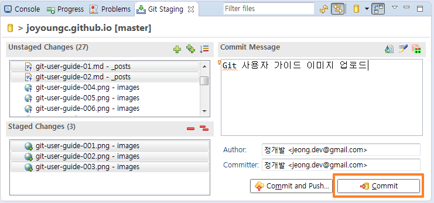

아래와 같이 [ 프로젝트 우클릭 > Team > Commit ] 액션으로 진행하셔도 됩니다. 바로 Git Staging이 열리며 Commit 메세지를 입력할 수 있게 이동 합니다. 

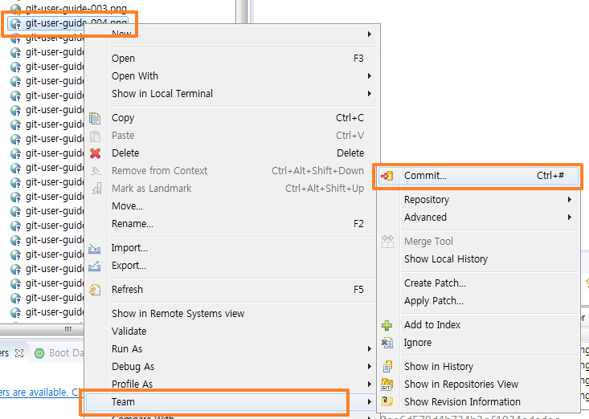

Commit이 완료되었으면 [ 프로젝트 우클릭 > Team > Show in History ] 를 클릭합니다. 

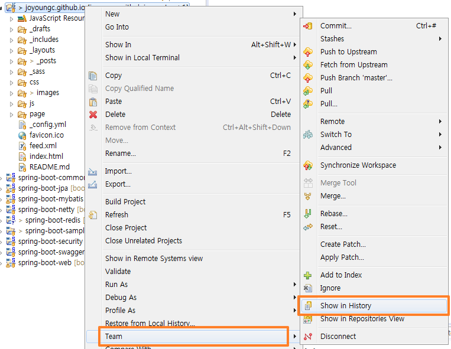

아래와 같이 방금 전의 커밋이 이력에 추가되어 있는 것을 확인 합니다. 

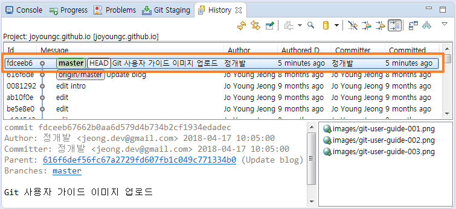

### 2.4 원격 저장소에 공유 하기

지금까지는 로컬 저장소의 기본적인 사용 방법을 설명했습니다. 이제부터는 원격 저장소를 이용하여 로컬 저장소의 변경 이력을 공유하는 방법에 대해 알아 보겠습니다.

#### a. push

내 PC의 로컬 저장소에서 변경된 이력을 원격 저장소에 공유하려면, 로컬 저장소의 변경 이력을 원격 저장소에 업로드해야 합니다.

웹 상의 원격 저장소로 변경된 파일을 업로드하는 것을 Git에서는 푸시(Push)라고 합니다. push 를 실행하면, 원격 저장소에 내 변경 이력이 업로드되어, 원격 저장소와 로컬 저장소가 동일한 상태가 됩니다.

전 과정에서 Commit했던 내용을 원격 저장소에 push 해보도록 하겠습니다. 

이클립스에서는 push할 항목이 있을 경우 아래와 같이 프로젝트 명 옆에 `↑ {push건수}` 로 표시가 됩니다. 

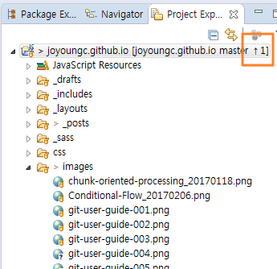

[ 프로젝트 우클릭 > Team > Push to Upsteam ]을 클릭합니다. 

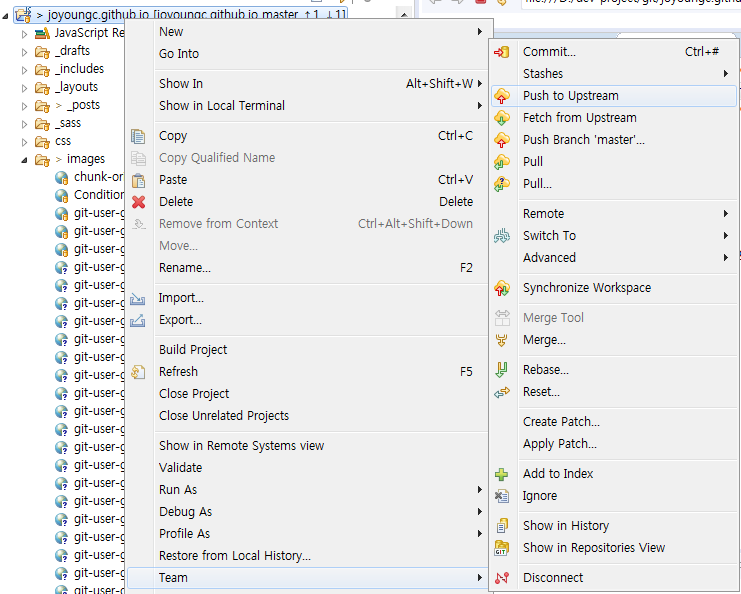

아래와 같은 화면이 나오면 push가 완료된 것입니다. 

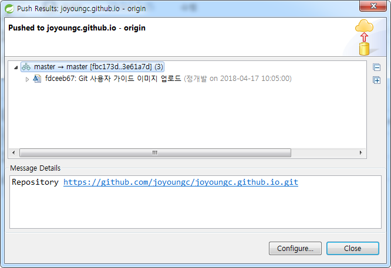

원격에 잘 반영되었는지 확인하기 위해서는 원격 Repository에 있는 Commits 이력을 참고하시기 바랍니다. 

#### b. pull

원격 저장소를 공유해 여러 사람이 함께 작업을 하면, 모두가 같은 원격 저장소에 푸시(Push)합니다. 그러면 다른 사람이 원격 저장소에 올려놓은(Push) 변경 내용을 내 로컬 저장소에도 적용(Pull)할 필요가 있습니다.

원격 저장소에서 로컬 저장소로 업데이트하려면 풀(Pull)을 실행합니다.

pull 을 실행하면, 원격 저장소에서 최신 변경 이력을 다운로드하여 내 로컬 저장소에 그 내용을 적용합니다.

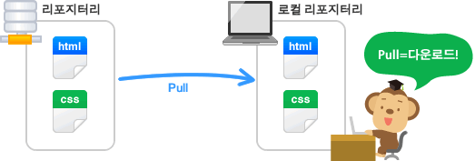

[ 프로젝트 우클릭 > Team > pull ]을 클릭합니다. 

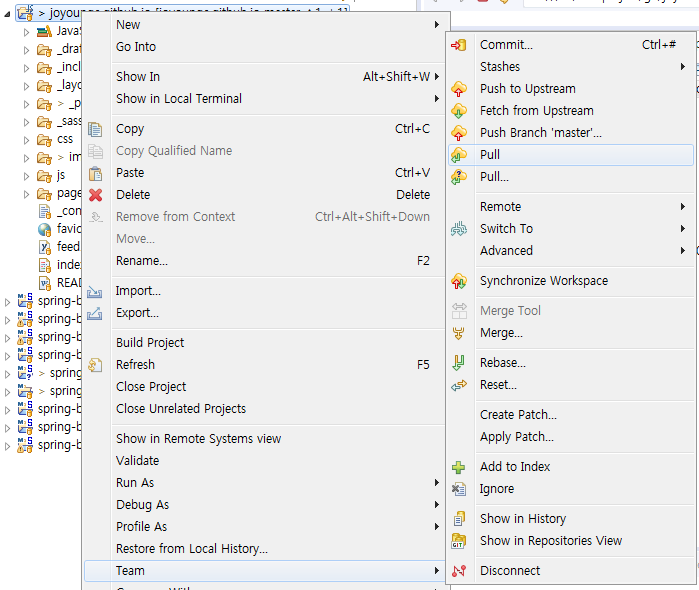

아래와 같은 화면이 나오면 pull이 완료된 것입니다. 

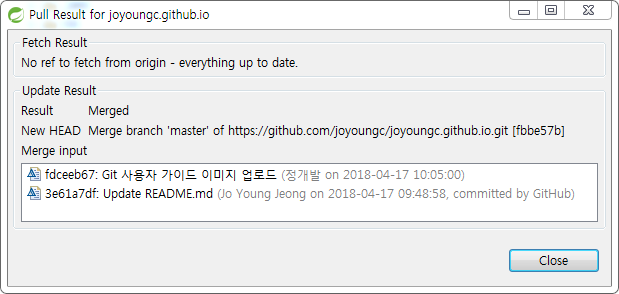

Commit 때와 같이 [ 프로젝트 우클릭 > Team > Show in History ] 에서 pull한 내용에 대해 이력이 추가되어 있는게 확인 가능합니다. 

## 참고 사이트
https://backlog.com/git-tutorial/kr/intro/intro1_1.html