# Git 사용자 가이드

## Git 되돌리기

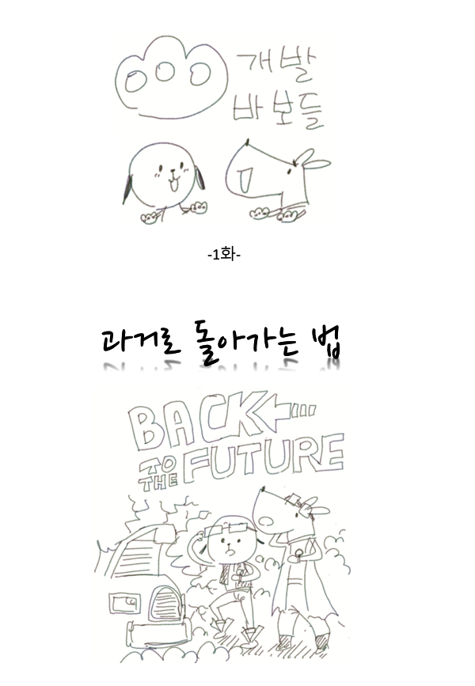
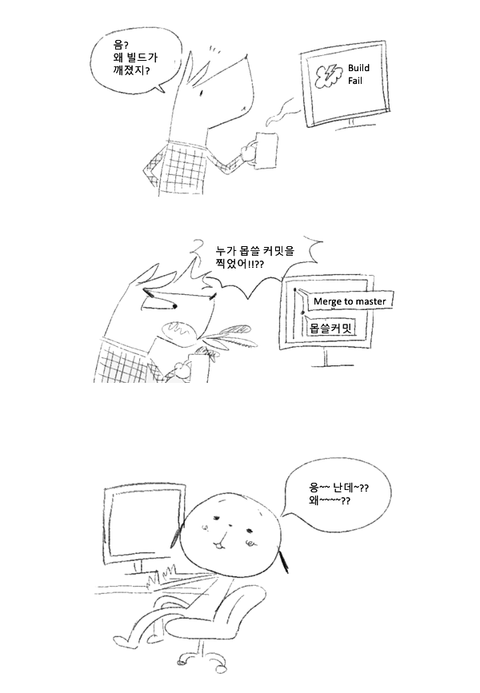
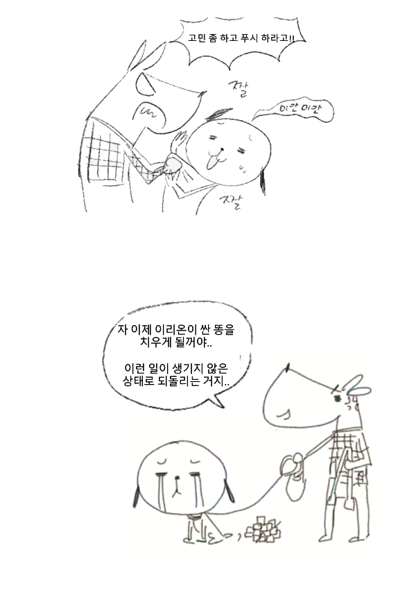
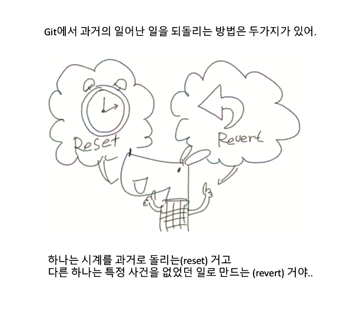
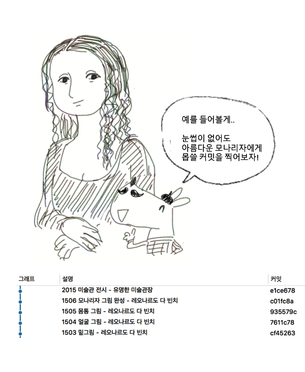
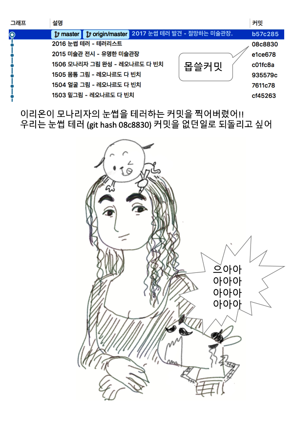
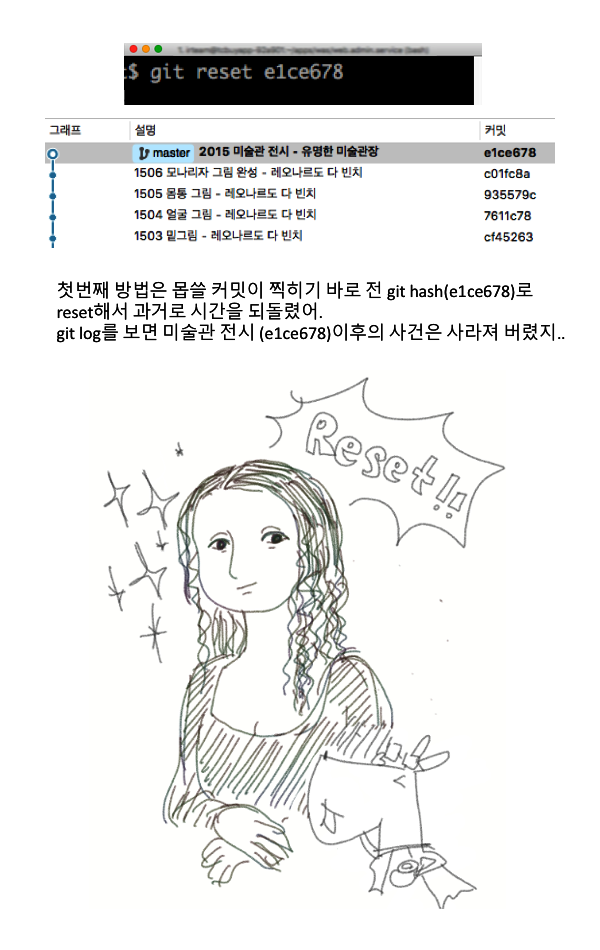
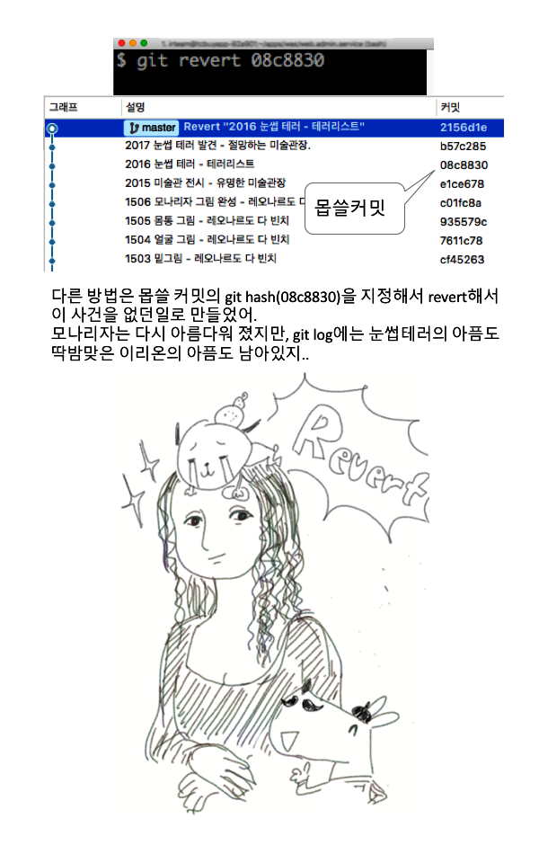
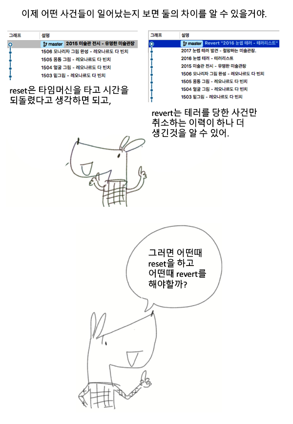
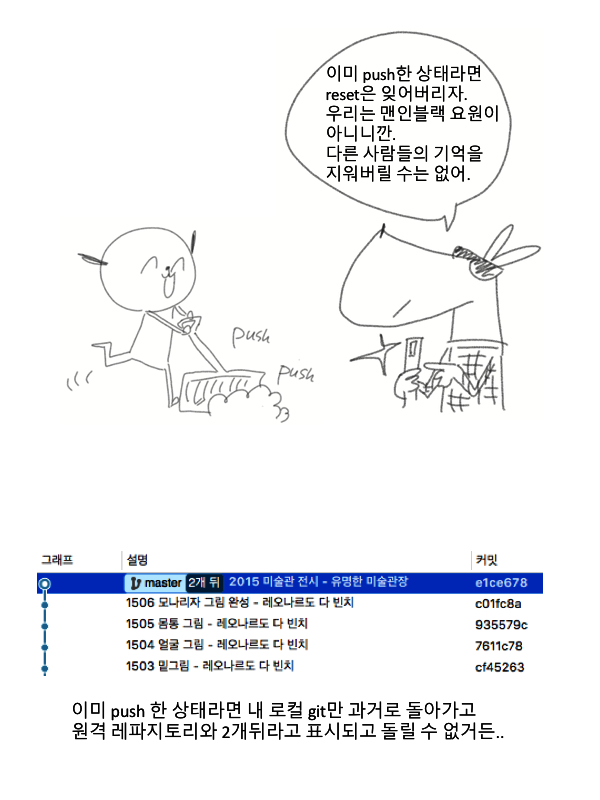

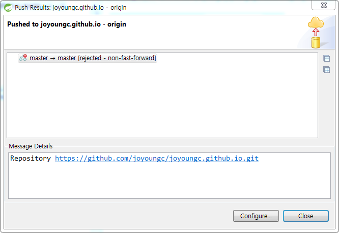

## 이클립스 기능

- Replace With

## 변경 이력의 통합

### 변경 이력 Merge 하기

### Conflict 해결하기 

## 이클립스 기능

- Replace With
- Comparing & Synchronizing

##참고 사이트 

http://www.devpools.kr/2017/01/31/%EA%B0%9C%EB%B0%9C%EB%B0%94%EB%B3%B4%EB%93%A4-1%ED%99%94-git-back-to-the-future/
