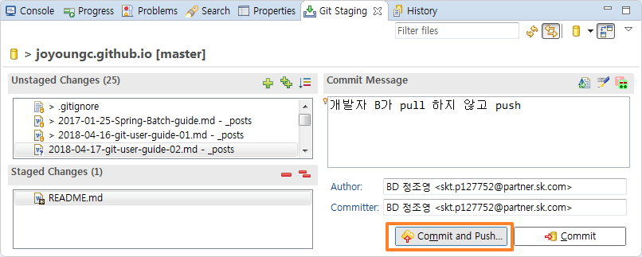
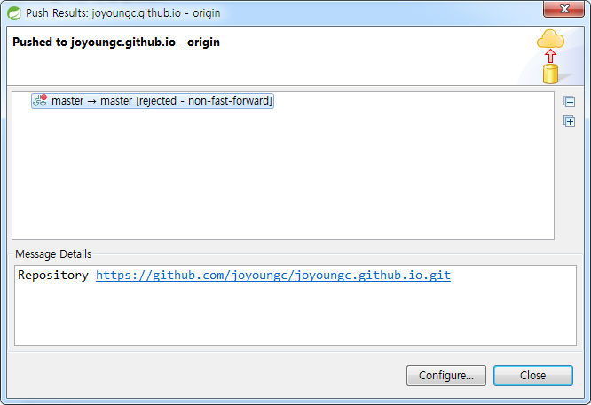
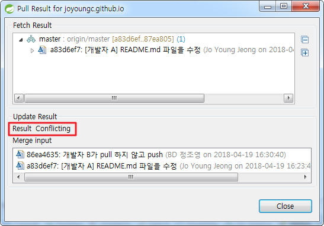
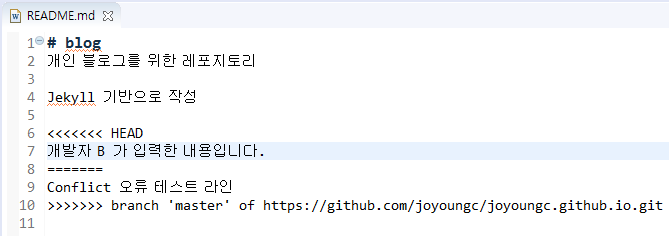

# 시나리오별 대응 방안 

## 1. 개발자 A가 push해서 원격 저장소에 반영이 완료된 소스를 개발자 B가 pull 하지 않고 push함.

예를 들어, README.md 파일을 개발자 A가 수정 후 push가 완료된 상태에서 같은 파일을 개발자 B가 수정 후 아무런 작업을 하지 않고 commit and push를 함.
 

이런 경우 아래와 같이 원격 Repository Server로부터 rejected이 됩니다. (rejected - non-fast-forward)
 

기본적으로 Git은 **다른 사람이 push한 후에 내가 push하려고 하면 push를 할 수 없고, 원격 저장소에서 다른 사람이 작업한 내용을 가져와(pull) merge한 후 push를 진행해야 합니다.**

merge 작업은 충돌되는 파일이 없다면 자동으로 진행됩니다. 

## 2. 개발자 A가 새로운 파일 생성 후 push 하였고, 개발자 B도 같은 이름의 파일을 생성하였지만  Commit은 하지 않았음.

예를 들어 개발자 A가 MCG_CAMSINFS0140T07_IN.java, MCG_CAMSINFS0140T07_OUT.java 파일을 새로 생성 후 push까지 완료하였습니다.

개발자 B는 같은 이름의 파일들을 새로 생성만 하였습니다. (Commit하지 않은 Untracked file의 상태)
> Untracked file의 의미는 Git에서 관리대상에 포함되지 않는다는 의미입니다. `인덱스에 등록` 또는 `Stage`가 안된 상태를 뜻합니다.

이 상태에서 개발자 B가 pull을 받을 경우 conflict 오류가 발생하는 것을 알 수 있습니다. 

이런 경우에는 두가지 케이스로 해결할 수 있습니다. 일단 Synchroize를 실행합니다. 

[ 프로젝트 우클릭 > Team > Syncronize Workspace ]을 클릭

conflict 오류가 발생한 파일을 더블클릭하면 Source Compare 창이 열립니다.

 **1. 개발자 B가 작업한 파일이 서버에 올라간 (개발자 A가 작업한) 파일과 동일할 경우** 

 

   - 공백의 차이를 제외하고 내용은 동일하다면 로컬에서 작업한 파일을 지우고 pull을 실행합니다. 

 **2. 개발자 B가 작업한 파일이 서버에 올라간 (개발자 A가 작업한) 파일과 동일하지 않을 경우**

  

   - 해당 파일을 commit하고 다시 pull을 받아 보도록 합니다. 
     정상적으로 pull이 되면 해당 파일들이 merge가 되는 것을 확인할 수 있습니다. ~~하지만 대부분 conflict가 날것입니다.~~ 이럴경우 Case 3 참고.

pull을 받기 전에는 로컬에서 수정된 파일을 로컬 리포지토리에 반영(Commit) 시켜 놓은 것이 이와 같은 오류를 방지하는 좋은 방법이 될 수 있습니다.

## 3. 개발자 A가 README.md 파일 수정 후 push하였고, 개발자 B도 README.md 파일을 수정 후 commit 하였음 (서로 같은 코드 라인 수정)

여기서 만약 pull을 받으면 충돌난 파일에 대한 Result는 Conflicting으로 되어 있을 것이고

 

소스는 다음과 같이 Git conflict annotation이 추가됩니다.

 

<<<<<< HEAD 부터 ==== 까지 로컬 소스 내용이고, ==== 를 기준으로 아래가 원격지의 소스 내용입니다.

- 해결방법
  1. [ 프로젝트 우클릭 > Team > Syncronize Workspace ] 클릭
  2. Conflict 난 파일을 선택 후 우클릭 > merge tool
  3. 적절하게 수정 후 파일 저장
  4. Add to index
  5. Commit (바로 원격 서버에 반영하려면 Commit and push)

