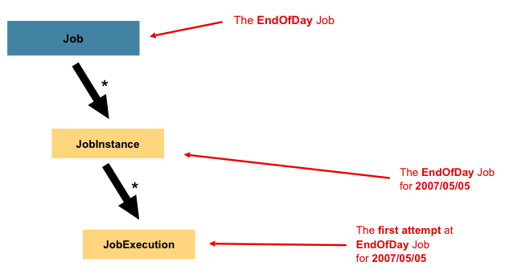
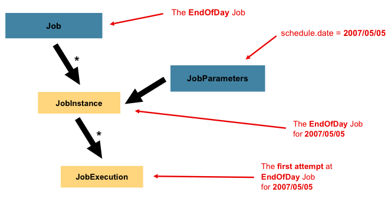
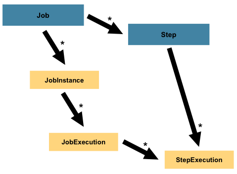
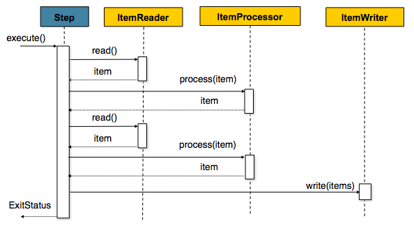

# 스프링 배치 개발가이드
## 1. 개요 및 스피링 배치 설명

### 스프링 배치
대용량 배치처리에 필요한 구조와 기능들을 제공하는 프로젝트로 배치업무에 특화된 프로그래밍 모델을 제공함

### 주요기능
- 프로그래밍 모델(Chunk based processing)
- 실행관리 (트랜잭션, 시작/중단/재시작, 재시도/건너뛰기)
- 관리기능 (로깅/추적, 통계, 모니터링)

### 주요개념
- #### Job
  - 하나의 배치작업을 정의하는 개념
  - Step의 집합

- #### Job Instance
  - Job의 실행에 대한 논리적인 개념
  - JobInstance는 다수의 JobExecution을 가진다.
  - 동일한 JobParameters를 가진 JobInstance는 생성불가

- #### Job Execution
  - Job Instance에 대한 한번의 실행시도를 의미
  - JobExecution은 Job에 대한 시도 결과(FAILED,COMPLETED)를 가진다.

- #### Job Parameters
  - Job을 시작하는데 사용되는 파라미터의 집합 (Map 형식)
  - JobInstance = Job + JobParameters

  
- #### Step
  - 배치 작업(Job)에 대한 순차적인 처리 단계를 의미함
  - 단순하거나 복잡(병렬,파티션,플로우 방식 등)하게도 구성할 수 있다.

  
  
- #### Step Execution
  - 한번의 Step 실행 시도를 의미함
  - Step이 실행될 때, 새로운 StepExecution이 생성된다.
  
- #### Tasklet
  - Step에서 실행되는 작업을 의미함
  - Chunk Oriented Processing Tasklet을 기본으로 제공
  - Tasklet을 별도로 구현하여 사용하는 것이 가능
  
- #### Chunk-Oriented Processing
Data를 한번에 하나씩 읽고 처리하며 트랜잭션 범위 내에서 'Chunk'를 만든 후 한번에 쓰는 방식이다. 

> Chunk 단위는 트랜잭션 Commit 단위

- #### Item Reader
  - Step의 처리대상이 되는 데이터를 조회하는 역할
  
- #### Item Writer
  - Step의 처리결과를 기록(저장)하는 역할
  
- #### Item Processor
  - Step의 ItemReader를 통해서 전달된 하나의 아이템에 대한 비즈니스로직을 처리하는 역할 

- #### Job Launcher
  - JobParameters를 이용하여 Job을 시작함
  - 실행 결과로 JobRepository와 실행 중인 Job에서 JobExecution 정보를 제공함
  
- #### Job Repository
  - Job의 실행정보(JobInstance, JobExecution, JobExecutionParams, JobExecutionContext, StepExecution, StepExecutionContext)에 대한 CRUD 오퍼레이션 처리를 담당
  
- #### Execution Context
  - Step, Job Execution 구동 중 발생하는 정보를 저장하는 컬렉션
  - Job 재시작시에 사용되는 정보를 담는다. 
  - Json 형태로 저장이 되면 최대 2500 byte를 저장하므로 단순한 값만 저장한다.   