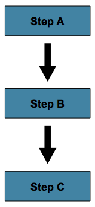
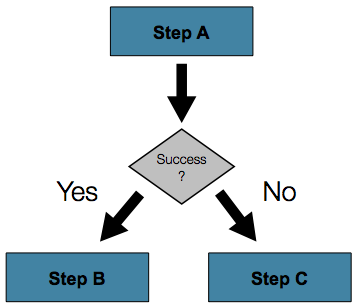

# 스프링 배치 개발가이드
## <a name="springbatch2"></a>2. 개발 표준
### 배치 프로젝트 구조
```
├── src/main/java
│   └── {업무레벨1}.{업무레벨2}
│       ├── batch
│       │   ├── tasklet         * tasklet 패키지
│       │   ├── scheduler       * scheduler 패키지    
│       │   └── item            * ItemReader, Writer, Processor 패키지
│       ├── service             * Service 인터페이스 패키지
│       ├── dao                 * Dao 인터페이스 패키지
│       └── model               * Model 클래스 패키지
├── src/main/resources
│   ├── config
│   │   ├── log                 * Logback 설정파일 폴더
│   │   ├── spring              * Spring 설정파일 폴더
│   │   └── batch
│   │       └── job             * Job 설정파일 폴더
│   ├── message                 * 메시지 프로퍼티 파일폴더
│   └── sql                     * Mybatis 설정 파일 및 SqlMapper.xml 폴더
└── src/test/java
    └── {업무레벨1}.{업무레벨2}    * Job 테스트 클래스 패키지
```

### 명명 규칙
대상 | 표준
------------ | -------------
Scheduler 클래스 | {프로젝트 패키지}.{업무카테고리}.batch.scheduler.{배치업무명}Scheduler.java
Job 설정 파일 | config/batch/job/{업무카테고리}/job-{배치업무명}.xml
Tasklet 클래스 | {프로젝트 패키지}.{업무카테고리}.batch.tasklet.{명사}Tasklet.java
ItemReader 클래스 | {프로젝트 패키지}.{업무카테고리}.batch.item.{Step아이디}ItemReader.java
ItemWriter 클래스 | {프로젝트 패키지}.{업무카테고리}.batch.item.{Step아이디}ItemWriter.java
ItemProcessor 클래스 | {프로젝트 패키지}.{업무카테고리}.batch.item.{Step아이디}ItemProcessor.java
Job 테스트 클래스 | {프로젝트 패키지}.{업무카테고리}.{Job}Test.java
Job 아이디 | {배치업무명}Job
Step 아이디 | {명사}Step


## 3. 배치작업 정의 절차
스프링 배치에서 제공하는 xml문법에 따라 배치작업을 정의함. (annotation 방식은 차후 포스팅 예정)

#### 배치작업 파일 생성
아래 형식의 xml 파일을 생성한다. (위치 및 파일 이름은 [2.개발표준](#springbatch2) 참고)
```xml
<beans:beans xmlns="http://www.springframework.org/schema/batch"
     xmlns:beans="http://www.springframework.org/schema/beans"
     xmlns:xsi="http://www.w3.org/2001/XMLSchema-instance"
     xsi:schemaLocation="
           http://www.springframework.org/schema/beans
           http://www.springframework.org/schema/beans/spring-beans.xsd
           http://www.springframework.org/schema/batch
           http://www.springframework.org/schema/batch/spring-batch-2.2.xsd">
           
</beans:beans>
```

#### Job 정의
Job에 대한 아이디와 Step 처리 흐름을 정의한다. 

#### Step 흐름 유형
- Sequential Flow : Step을 정해진 순서대로 실행함



```xml
<job id="job">
    <step id="stepA" parent="s1" next="stepB" />
    <step id="stepB" parent="s2" next="stepC"/>
    <step id="stepC" parent="s3" />
</job>
```

- Conditional Flow : StepExecution 내의 ExitStatus 값을 이용하여 흐름을 분기 실행함


```xml
<job id="job">
    <step id="stepA" parent="s1">
        <next on="*" to="stepB" />
        <next on="FAILED" to="stepC" />
    </step>
    <step id="stepB" parent="s2" next="stepC" />
    <step id="stepC" parent="s3" />
</job>
```

- Split Flow : 흐름을 분할하고 병행 실행해야 하는 흐름
```xml
<split id="split1" next="step4">
    <flow>
        <step id="step1" parent="s1" next="step2"/>
        <step id="step2" parent="s2"/>
    </flow>
    <flow>
        <step id="step3" parent="s3"/>
    </flow>
</split>
<step id="step4" parent="s4"/>
```

>(1) Job 정의 
 - id : Job아이디
 - restartable : Job에 대해서 재시작 가능 여부(default : true)
 
>(2) Step 정의
 - id : Step의 아이디
 - next : 다음에 실행되어야 하는 Step의 아이디 (Sequential Flow인 경우에 한하여 설정함)
 
>(3) ExitStatus 값에 따라서 분기 실행되어야 하는 Step 정의 
 - on : ExitStatus 값
 - to : 다음에 실행되어야 하는 Step
 
>(4) Job 실행 중지 정의 (ExitStatus에 따라서 결정)
 - on : ExitStatus 값
 - restart : Job을 재시작하는 경우 실행되는 Step

>(5) Job 실행 완료 정의 (ExitStatus에 따라서 결정)
 - on : ExitStatus값
 
>(6) Job 실행 실패 (ExitStatus에 따라서 결정)
 - on : ExitStatus값
 
 
## 4. Step 정의 절차
Step의 Tasklet 종류와 설정

#### Chunk Tasklet
기본적인 형태의 Tasklet으로 Chunk Oriented Processing 방식에 기반한 Tasklet

```xml
<job id="sampleJob">
    <step id="step1">
        <tasklet>
            <chunk reader="itemReader" writer="itemWriter" commit-interval="10"/>
        </tasklet>
    </step>
</job>
```
>(1) ItemReader (필수)
>(2) ItemProcessor (옵션)
>(3) ItemWriter (필수)
>(4) commit-interval - transaction commit 크기

#### 개발자 정의 Tasklet
개발자의 필요에 의해서 만들어진 Tasklet을 실행하도록 설정함
```xml
<step id="step1">
    <tasklet ref="myTasklet"/>
</step>
```
> (1) Spring bean으로 등록된 개발자 정의 Tasklet의 bean id를 설정한다.


## 5. 배치 작업 실행 클래스 개발
Step 내에서 실행되는 ItemReader, ItemWriter, ItemProcessor와 CustomTasklet 개발방법 설명

#### ItemReader
처리대상의 데이터를 한건씩 리턴하여 다 소모될때까지 수행되는 클래스 
```java
@Component  <-- (1)
@Scope("step")  <-- (2)
public class SampleItemReader implements ItemStreamReader<CodeGroup> <-- (3) {
    @Override
    public CodeGroup read() throws Exception, UnexpectedInputException, ParseException, 
    NonTransientResourceException { <-- (4)
        return new CodeGroup();
    }
    void open(ExecutionContext executionContext) throws ItemStreamException {}
    void update(ExecutionContext executionContext) throws ItemStreamException {}
    void close() throws ItemStreamException {}    
}
```
>(1) 스프링 빈으로 등록하기 위해 설정
>(2) 스프링 빈의 범위를 step으로 설정
>(3) org.springframework.batch.item.ItemReader<T> 인터페이스를 구현함을 설정
>(4) read() 메서드 구현, 처리대상 데이터를 한건씩 조회하여 리턴함.
>주의사항 : 병렬처리 대상이 되는 경우, Thread Safe에 대한 구현이 필요
>※ 스프링배치에서 미리 구현된 다양한 ItemReader 구현체가 존재함. (http://docs.spring.io/spring-batch/trunk/reference/html/listOfReadersAndWriters.html)